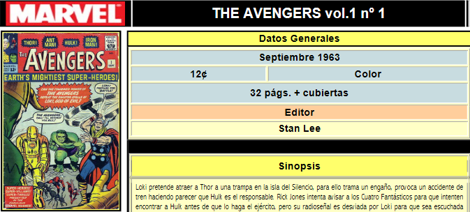

- **Ficha Club:** por club                  
    
    *"... la lista de todos sus miembros activos para el momento de cada consulta."*

- **Ficha Coleccionista** por coleccionista: 

    - Datos personales, nacionalidad, lugar de residencia (ciudad y pais), telefono, e-mail de contacto
    - Lista de sus membresias activas y pasadas, con nombre del club, fecha de inicio, fecha fin (si aplica) y total de años de cada una para el momento de la consulta. Se deben mostrar cronologicamente de manera descendente. 
    - La coleccion de objetos de esa persona
- **Resumen de Participacion:** por coleccionista: 
    
    *"... para un periodo de tiempo, mostrar la lista de eventos en los que ha participado especificando el rol que desempeñe en cada uno (vendedor o comprador) y cual club representaba. El resumen debe estar organizado por rol - primero como vendedor, segundo como comprador y en cada caso se debe presentar la informacion cronologicamente."*

- **Ficha Evento** por evento:

    - el club organizador, los participantes compradores con el club representan
    - los objetos a subastar especificando el orden, el precio base en las dos monedas, el dueño del objeto y la duracion total para las pujas
    - En la subasta de **caridad** tambien va la informacion de las organizaciones que recibiran el dinero resultante de las ventas logradas y el % que le corresponde recibir a cada una 

- **Resultados Evento** por evento:

    - Objetos vendidos: precio alcanzado, nuevo dueño (con su club)
    - Objetos no vendidos
    - En las subastas de **caridad**, el total otorgado a cada organizacion.

- **Planificacion Anual:** 
            
            por club? o planificacion de todos juntos
    
    *"Para evitar solapamientos, los encargados de cada club comparten su planificacion (fecha estimada, lista de clubes a invitar) con los demas para que el calendario anual de subastas se pueda realizar sin solapamientos."*

- **Informe semestral de desempeño** por club:

    1. *"El coleccionista que ha adquirido el objeto de mayor precio (se debe mostrar el objeto, el precio y en que evento ocurrio)."*
    2. *"Total monetario otorgado en subastas de caridad (mostrando las organizaciones y el total otorgado individualmente)."*
    3. *"El coleccionista que ha comprado mas objetos (se debe mostrar la lista de los objetos adquiridos)."*

- **Ficha comic:** *"The Avengers vol.1 #1 (septiembre 1963)*"

    

- **Historia de un objeto** por objeto:

    *"... dueños que ha tenido, dueño actual para el momento de la consulta, como ha variado su precio a lo largo de las subastas en las que ha participado."*
